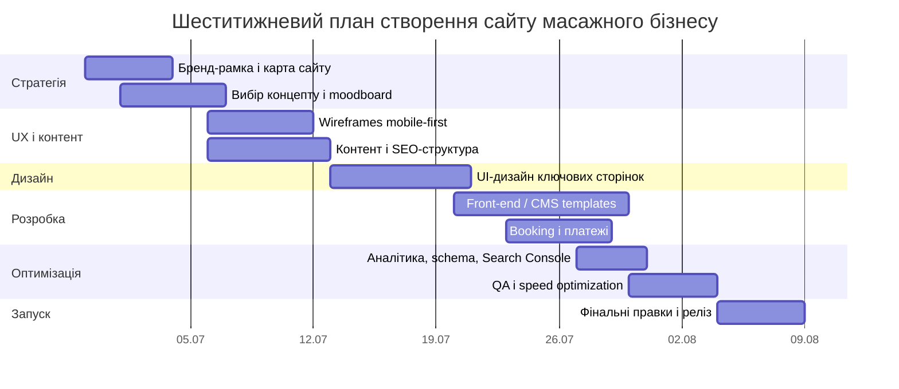

# Глибоке дослідження для створення п’яти дизайн-концепцій сайту масажного бізнесу в Одесі

## Виконавче резюме

На основі наданого флаєра видно чітке позиціонування не як “гламурний SPA-салон”, а як локальний сервіс масажу з акцентом на **здоров’я, полегшення болю, відновлення, індивідуальний підхід і відчутний результат**. Це важливо: якщо сайт піде в надто люксовий або надто “медичний” бік, він почне брехати очам відвідувача. А сайт, який бреше з першого екрану, продає гірше, ніж мовчазний холодильник. За стилем флаєр уже задає напрям: теплі натуральні тони, зелений як код довіри, м’яка фотографія, тексти про турботу й користь. Тож найсильнішим базовим напрямом для реального запуску я вважаю концепт **«Тепла терапія»**, а найкращим запасним варіантом — **«Морський спокій»**, якщо хочете сильніше прив’язати бренд до Одеси та атмосфери Фонтану.  

З точки зору конверсії, сайт для такого бізнесу має бути **mobile-first**, однолокаційним, дуже простим у навігації, з постійно видимими CTA: **«Записатися онлайн»** і **«Зателефонувати»**, а примітку **«Попередній запис обов’язковий»** треба повторити в hero-блоці, на сторінці запису, в контактах і в шаблоні кожної послуги. Найкраща технічна модель без жорстких бюджетних обмежень: **WordPress** як гнучка CMS або **Webflow** як швидший візуальний варіант для brochure-style сайту; для запису — **Amelia** або **Bookly**; для оплат/передоплати — **WayForPay**; для аналітики — **GA4**, **Google Tag Manager**, за потреби **Meta Pixel**; для локального SEO — **Google Business Profile**, **Search Console**, sitemap, robots.txt і структуровані дані типу **LocalBusiness** з можливим уточненням до **HealthAndBeautyBusiness** або **DaySpa**. Для доступності варто цілитись у **WCAG 2.2**, а для продуктивності — у Core Web Vitals: LCP до 2.5 с, INP до 200 мс, CLS до 0.1 на 75-му перцентилі. citeturn5search10turn5search13turn2search13turn2search4turn2search2turn2search5turn2search3turn3search16turn3search9turn6search3turn6search5turn1search7turn1search3turn9search0turn9search2turn1search0turn8view0turn8view1turn8view2

Структурно ринок показує просту істину: сильні сайти масажу та wellness-сервісів виграють не “вау-анімацією”, а комбінацією **емоційного першого екрану, чіткої карти послуг, негайного CTA на запис, видимого контакту, довіри й середовища**. Локальні приклади в Одесі показують різні акценти: одні піднімають атмосферу й релакс, інші — ширину меню та консультацію, треті — gift cards, booking та інтер’єр. Міжнародні референси стабільно працюють через benefit-led copy та швидкий запис. Саме це й треба взяти, не копіюючи готельну перевантаженість або франшизний “комбайн”. citeturn0search1turn0search8turn0search11turn4search0turn4search18

Критично важлива аналітична ремарка: на флаєрі **немає явної назви бренду**, **немає цін**, **немає графіка роботи**, **немає імені спеціаліста**. Це не дрібниці. Це чотири діри, через які сайт може втрачати довіру вже на старті. Тому незалежно від обраного концепту в топ-пріоритеті мають бути: назва/бренд, фотопортрет або реальне представлення майстра, прайс або хоча б “від…”, правила запису, і підтверджена контактна інформація в однаковому форматі на всіх майданчиках.

## Контент, витягнутий із флаєра

Нижче — ручне зчитування змісту з наданого флаєра. Формулювання збережені максимально близько до оригіналу.

### Основні тексти та слогани

| Блок | Текст |
|---|---|
| Заголовок | **МАСАЖ В ОДЕСІ** |
| Підзаголовок | **Ваше тіло щодня працює для вас — подаруйте йому відпочинок, відновлення та турботу, на яку воно заслуговує!** |
| Ключовий заклик | **Перший крок до здоров’я — запишіться на консультацію вже сьогодні!** |
| Опис | **Запрошую на професійний масаж для здоров’я, краси та гарного самопочуття!** |
| Блок результатів | **Вже після перших сеансів ви відчуєте:** |
| Підсумковий меседж | **Масаж — це не лише приємна процедура, а й інвестиція у ваше здоров’я, красу та якість життя. Дозвольте собі відчути легкість, енергію та гармонію вже сьогодні!** |
| Мікро-переваги | **Індивідуальний підхід до кожного клієнта** · **Комфортна атмосфера та турбота про ваше здоров’я** · **Працюю на результат** |

### Повний перелік послуг

| Послуга | Формулювання з флаєра |
|---|---|
| Лікувальний масаж | при болях у спині, шиї, попереку, м’язовій напрузі та втомі |
| Вісцеральний масаж живота | для покращення роботи внутрішніх органів, травлення та загального самопочуття |
| Антицелюлітний масаж | для зменшення проявів целюліту, покращення тонусу шкіри та корекції контурів тіла |
| Лімфодренажний масаж | для зменшення набряків, виведення зайвої рідини та відчуття легкості в тілі |
| Медовий масаж | для очищення організму, покращення кровообігу та відновлення енергії |
| Дитячий масаж та гімнастика | для гармонійного фізичного розвитку, покращення постави та зміцнення організму |
| Глибокий масаж обличчя | для покращення тонусу шкіри, розслаблення м’язів та природного омолодження |
| Масаж для вагітних | для зменшення напруги, набряків та покращення самопочуття майбутньої мами |
| Спортивний масаж | для відновлення після фізичних навантажень, профілактики травм та покращення працездатності м’язів |
| Вогняний масаж | для глибокого розслаблення, покращення кровообігу та відновлення життєвого тонусу |

### Повний перелік заявлених вигод

| Блок вигод | Формулювання з флаєра |
|---|---|
| Вигода | Зменшення болю та м’язової напруги |
| Вигода | Покращення постави, рухливості та загального самопочуття |
| Вигода | Зменшення набряків і відчуття важкості в тілі |
| Вигода | Покращення кровообігу та лімфотоку |
| Вигода | Підтягнуті контури тіла та зменшення проявів целюліту |
| Вигода | Покращення травлення та роботи внутрішніх органів |
| Вигода | Глибоке розслаблення, зниження стресу та покращення сну |
| Вигода | Більше енергії, легкості та гармонії у тілі |
| Вигода | Свіжіший вигляд, покращення тонусу та природне омолодження обличчя |
| Вигода | Відновлення після фізичних навантажень і покращення спортивної форми |
| Вигода | Покращення настрою, підвищення життєвого тонусу та відчуття внутрішньої гармонії |
| Вигода | Турботу про себе, яка позитивно впливає не лише на тіло, а й на емоційний стан |

### Контактні дані та службова інформація

| Поле | Значення |
|---|---|
| Адреса | **Одеса, Фонтанська дорога, 58/3** |
| Телефон | **096 859 24 65** |
| Примітка | **Попередній запис обов’язковий** |
| Додатковий підпис | **Запис та консультація** |

### Контентні висновки для сайту

Флаєр продає через три осі: **користь для здоров’я**, **емоційне полегшення**, **результат після перших сеансів**. Це означає, що сайт має вибудовувати ієрархію не від “про нас”, а від “що я отримаю”, “кому це підходить”, “як записатися”, “чому вам можна довіряти”. Другий нюанс: у флаєрі дуже багато сервісів, але немає структурування за сегментами. На сайті це треба виправити й розкласти послуги хоча б на групи: **оздоровчі**, **естетичні**, **для мам і дітей**, **відновлювальні**. Інакше користувач потоне в списку ще до того, як натисне кнопку запису.

## Ринкові орієнтири та референси

У локальних і міжнародних референсах повторюється одна й та сама логіка: сильні сайти wellness-напряму одразу показують **стан, який отримає клієнт**, а не просто меню послуг. **Insay SPA** у комунікації робить ставку на “оазис спокою” та широкий спектр масажів і SPA-послуг; це хороший урок для емоційного hero-блоку та візуального тону. **Calma** акцентує на великому наборі методик і навіть консультації лікаря, що підсилює відчуття експертності, але така модель ризикує перевантажити невеликий приватний сайт. **Bali Spa** добре показує, що окрім сторінки послуг варто думати про **booking**, **gift certificate** і навіть показ інтер’єру — простір теж продає. citeturn0search1turn0search8turn0search11

Серед міжнародних прикладів особливо корисний **The NOW Massage**: на сайті домінує спокійний lifestyle-образ, сильний benefit-led герой і прямий CTA **Book Now**, без зайвої словесної гречки. **Elements Massage** будує довіру через персоналізацію послуг і сильний заклик до запису, але франшизна логіка з локатором студій і membership не підходить один-в-один для одного кабінету на Фонтані. Брати треба не структуру франшизи, а чіткість сегментації, користь у заголовках і простоту запису. citeturn4search0turn4search4turn4search18turn4search2

П’ять референсів, які реально мають сенс для наслідування, такі:

**Insay SPA** — емоційний спокій + атмосферність + широкий wellness-асортимент. Добре підходить як референс для hero, mood-фотографії й тону “турботи”. Слабкість для копіювання: надто широкий SPA-профіль може розмити акцент приватного масажного кабінету. citeturn0search1

**Calma** — сильний референс для блоку “напрями масажу” і підсилення довіри через експертність. Слабкість: якщо наслідувати буквально, сайт стане каталогом, а не зрозумілим шляхом до запису. citeturn0search8

**Bali Spa** — дуже корисний як приклад додаткових конверсійних активів: booking, gift certificates, візуалізація простору. Для приватної практики це означає: фото кабінету — не опція, а необхідність. citeturn0search11

**The NOW Massage** — еталон того, як поєднати спокійний преміальний стиль, benefit-oriented текст і мінімалістичний запис. Ідеально для концепту “Бутик тиші” або “Морський спокій”. citeturn4search0turn4search4

**Elements Massage** — хороший референс для інформаційної архітектури, блоків персоналізації та коротких сервісних описів. Але всі франшизні штуки — повз, не треба робити з малого бізнесу корпорацію в піджаку не за розміром. citeturn4search18turn4search2

Підсумок для проєкту простий: потрібно взяти **атмосферу й benefit-first підхід**, але залишити **архітектуру компактною**. Для одного масажного кабінету в Одесі ідеальна модель — **5 основних сторінок + деталізація послуг + дуже простий запис**.

## Дизайн-концепції

Нижче — п’ять різних концептів. Усі вони можуть використовувати один і той самий контент із флаєра, але дають різне позиціонування, різну аудиторну оптику і різну “ціну в очах клієнта”.

### Швидкі палітри-світчі

| Концепт | Зразок палітри |
|---|---|
| Тепла терапія | `[#F4EEE6] [#D8C8B5] [#6B7A49] [#39442B] [#B57A45]` |
| Морський спокій | `[#F7FAFB] [#DCECEF] [#7CA4AE] [#2F5A63] [#E3C7A4]` |
| Бутик тиші | `[#F7F3EE] [#C9B08A] [#4B5A41] [#1F241D] [#8A6A4A]` |
| Мама і дитина | `[#FFF8F1] [#E7E0D4] [#A8B89A] [#7D6F6A] [#D8B6A4]` |
| Тіло в балансі | `[#F2F2EE] [#C8CCBE] [#58604D] [#2C2F2A] [#B88952]` |

**Концепт «Тепла терапія»**  
Це найприродніше продовження самого флаєра. Тон — довірчий, теплий, професійний, без глянцю й без холодної “клінічності”. Цільова аудиторія: дорослі 28–55 років, які шукають полегшення болю в спині/шиї, зниження напруги, лімфодренаж, антицелюлітний догляд, відновлення після навантажень. Головна мета сайту — швидко пояснити користь і дати людині безпечний шлях до запису.  

Карта сайту: **Головна → Послуги → Детальна сторінка послуги → Запис → Про мене → Контакти → FAQ → Політика конфіденційності**.  
Ідеальна навігація: ліворуч логотип/назва, праворуч меню, у шапці одразу телефон і CTA на запис.

```text
Головна
[топ-бар: адреса | телефон | попередній запис обов'язковий]
[header: логотип | послуги | про мене | запис | контакти]
[hero: фото + H1 + підзаголовок + 2 CTA]
[3 довірчі іконки: індивідуально / комфорт / результат]
[блок "Мої послуги" у 2 колонки]
[блок "Після перших сеансів ви відчуєте"]
[про спеціаліста + фото]
[карта + контакти + запис]

Послуги
[H1]
[фільтри: оздоровчі / естетичні / для мам і дітей / відновлення]
[картки послуг: коротко + кому підійде + CTA]
[FAQ]
[нижній CTA на запис]

Запис
[крок 1: вибір послуги]
[крок 2: дата/час]
[крок 3: ім'я + телефон + коментар]
[чекбокс підтвердження]
[альтернатива: "зателефонувати"]

Про мене
[портрет]
[підхід до роботи]
[кому допомагаю]
[принципи роботи]
[CTA]

Контакти
[адреса]
[телефон]
[карта]
[години — placeholder до уточнення]
[нотатка про попередній запис]
```

Mobile-first: sticky bottom bar з двома кнопками **«Запис»** і **«Подзвонити»**, акордеони для списку послуг, короткі картки вигод, на першому екрані без каруселей та без відео-цирку.  
Візуальна айдентика: кольори `#F4EEE6`, `#D8C8B5`, `#6B7A49`, `#39442B`, `#B57A45`; шрифти **Marcellus** для заголовків і **Manrope** для інтерфейсу; зображення — теплі бежеві текстури, руки майстра, натуральні тканини, реальний кабінет; іконки — тонкі line-icons з легким botanical touch; hero-макет — фото праворуч, текст ліворуч, внизу два CTA. Це концепт для довіри, а не для позерства.

**Концепт «Морський спокій»**  
Тут сайт прив’язується до Одеси сильніше: повітря, світло, відчуття моря, чистоти й легкості. Це не “морська тема” в лоб із ракушками, а скоріше ранковий Фонтан: простір, дихання, світлий горизонт. Цільова аудиторія: жінки 25–45, офісні працівники, жителі району, клієнти на антистрес, лімфодренаж, anti-cellulite, обличчя та “повернути тіло до себе”. Мета — не лише запис, а й емоційний вибір саме цього місця серед десятків “масаж Одеса”.  

Карта сайту: **Головна → Послуги → Запис → Про простір/підхід → Контакти → FAQ**.  
Навігація легша, повітряніша, з акцентом на атмосферу та локацію.

```text
Головна
[hero full-screen: світлий простір/море + floating content card]
[H1 + benefits chips + CTA]
[секція "Чому саме тут"]
[секція 4 груп послуг]
[блок атмосфери: фото кабінету]
[відгуки/цитати placeholder]
[адреса + маршрут + контакти]

Послуги
[великий атмосферний заголовок]
[сітка 2x2 категорій]
[кожна категорія відкриває список технік]
[нижній фіксований CTA]

Запис
[коротка форма на 1 екран]
[вибір послуги dropdown]
[бажаний день/час]
[телефонний fallback]

Про
[фото простору]
[філософія "відпочинок, відновлення, турбота"]
[як проходить сеанс]
[для кого підходить]

Контакти
[карта + адреса]
[телефон]
[блок "як дістатися"]
[попередній запис обов'язковий]
```

Mobile-first: візуальний фокус на одному сильному hero-зображенні, короткі секції, великі відступи, кнопки не дрібніші за людський палець, мінімум текстового шуму.  
Айдентика: `#F7FAFB`, `#DCECEF`, `#7CA4AE`, `#2F5A63`, `#E3C7A4`; шрифти **Cormorant Garamond** + **Inter**; imagery style — природне денне світло, білі рушники, світлі тканини, вода, повітря, Одеса без туристичної шароварщини; icons — плавні округлі outline-іконки; hero-макет — фонове фото, напівпрозора картка з H1 і двома CTA. Це вже не просто “послуга”, а маленька втеча від шуму.

**Концепт «Бутик тиші»**  
Цей варіант піднімає сприйняту вартість. Він ближчий до premium wellness boutique: спокій, тиша, мінімалізм, глибина, приватність. Цільова аудиторія: професіонали 30–55, клієнти, які готові платити більше за атмосферу, естетику і персоналізований сервіс, а також люди, що приходять “не просто на масаж, а на паузу від світу”. Головна ціль — менше лідів, але якісніші та дорожчі.  

Карта сайту: **Головна → Послуги → Ритуали/Сеанси → Запис → Про → Контакти**.  
У цій концепції навіть назви видів послуг можна трохи стилістично пом’якшити, але без втрати ясності: не лише “антицелюлітний масаж”, а “корекційний догляд для тіла”; не лише “масаж обличчя”, а “глибокий догляд для обличчя”.

```text
Головна
[мінімалістична шапка]
[hero: темний спокійний фон + короткий сильний текст + CTA]
[секція 3 ключових переваг]
[сітка преміальних карток послуг]
[блок "простір і ритуал"]
[короткий блок про майстра]
[запис]
[контакти]

Послуги
[великий editorial heading]
[картки з фото-фрагментами]
[коротко / для кого / ефект / CTA]
[делікатний upsell на подарунковий сертифікат — якщо додасте]

Запис
[покроковий wizard]
[можливість обрати тип сеансу]
[номер телефону на кожному кроці]
[confirmation screen]

Про
[портрет у стилі editorial]
[цінності]
[формат роботи]
[персональний підхід]

Контакти
[темна карта/світлий блок]
[адреса]
[телефон]
[маршрут]
```

Mobile-first: типографіка крупна, кнопки великі, один dominant CTA на екрані, менше скрол-втоми, без кричущих банерів.  
Айдентика: `#F7F3EE`, `#C9B08A`, `#4B5A41`, `#1F241D`, `#8A6A4A`; шрифти **Playfair Display** + **Manrope**; imagery — темні м’які тіні, крупні плани рук, свічки, фактури льону, дерева, каменю; icons — ультратонкі монохромні; hero-макет — темний фон, короткий H1, один primary CTA і маленький secondary “Подзвонити”. Це концепт, який дає відчуття “private session”, а не “черговий масажний кабінет”.

**Концепт «Мама і дитина»**  
Це окремий маршрут, якщо хочете сильніше витягнути послуги для вагітних, дитячий масаж і загальну м’яку турботу. Такий сайт говорить безпечніше, спокійніше й тепліше. Цільова аудиторія: жінки 24–40, майбутні мами, молоді батьки, сім’ї, які шукають делікатний і неагресивний сервіс. Мета — зменшити тривогу, підвищити відчуття безпеки та пояснити процес дуже прозоро.  

Карта сайту: **Головна → Послуги → Для вагітних → Для дітей → Запис → Про → Контакти → FAQ**.  
Головний принцип — не тиснути “продаючим” стилем, а вести спокійно й ясно.

```text
Головна
[ніжний світлий hero]
[H1 + спокійний підзаголовок + CTA]
[2 основні маршрути: для майбутніх мам / для дітей]
[блок загальних послуг]
[блок "як проходить запис"]
[блок про підхід]
[контакти]

Послуги
[tab navigation: загальні / вагітність / дитячий]
[картки послуг з поясненням]
[поширені запитання]
[CTA]

Запис
[проста форма]
[окрема нотатка про попередній запис]
[поле "вкажіть особливості/запит"]
[телефонний варіант]

Про
[теплий портрет]
[принципи спокійної ненасильницької комунікації]
[підхід до дорослих і дітей]

Контакти
[адреса]
[телефон]
[карта]
[короткий маршрут]
```

Mobile-first: велика читабельність, короткі абзаци, інтерфейс без “преміального шепоту”, бо тут важлива не стилізація, а ясність.  
Айдентика: `#FFF8F1`, `#E7E0D4`, `#A8B89A`, `#7D6F6A`, `#D8B6A4`; шрифти **Literata** + **Nunito Sans**; imagery — м’яке природне світло, спокійні пози, без сексуалізованих масажних фотостоків; icons — округлі, дружні; hero-макет — світлий фон, м’яка фотографія, окремі кнопки **«Запис для дорослих»** і **«Запис для дитини/консультацію»**.

**Концепт «Тіло в балансі»**  
Це найбільш “результатний” і функціональний варіант. Він підходить, якщо хочете сильніше цілити в пошук за больовими запитами, відновленням, поставою, м’язовою напругою, спортом і працездатністю. Цільова аудиторія: чоловіки й жінки 25–50, офісні працівники, спортзал-аудиторія, люди з сидячою роботою, активні клієнти, яким треба не “атмосфера”, а помітний ефект. Мета — конверсія з локального пошуку та чітке пояснення, кому яка послуга підходить.  

Карта сайту: **Головна → Послуги → Масаж для спини/шиї → Лімфодренаж → Спортивне відновлення → Запис → Про → Контакти**.  
Тут можна робити більше service-detail сторінок під локальне SEO.

```text
Головна
[hero з чітким УТП]
[CTA + телефон]
[сітка "ваша проблема / наше рішення"]
[види масажу]
[вигоди після сеансів]
[як проходить запис]
[про майстра]
[контакти]

Послуги
[категорії за запитом клієнта]
[болі в спині / набряки / відновлення / обличчя / вагітність]
[картки з результатом]
[локальний SEO блок]

Запис
[minimal wizard]
[service -> date -> contact]
[phone backup]
[sticky CTA]

Про
[досвід + підхід + на кого орієнтуюсь]
[блок "працюю на результат"]

Контакти
[NAP блок]
[карта]
[кнопка "прокласти маршрут"]
```

Mobile-first: sticky CTA, короткі блоки “Проблема → Рішення”, великі кнопки, швидкі мікроформи, пріоритет швидкості над візуальним пафосом.  
Айдентика: `#F2F2EE`, `#C8CCBE`, `#58604D`, `#2C2F2A`, `#B88952`; шрифти **Sora** + **PT Serif**; imagery — реальні пози масажу, м’язи/постава/відновлення без бодібілдерської агресії; icons — більш функціональні, геометричні; hero-макет — текст на світлому фоні, фото в правій частині, блок переваг у вигляді quick facts.

## UX/UI, контент і технічна специфікація

Незалежно від концепту, UX-рамка має бути одна: верхнє меню з мінімальною кількістю пунктів, два базові CTA — **онлайн-запис** і **дзвінок**, видимий телефон у шапці, повтор адреси у футері, а також короткий NAP-блок у контактах. Потік запису повинен бути коротким: **послуга → дата/час → контакти → підтвердження**, із телефонним fallback на кожному кроці. Для мобільних обов’язковий sticky bottom bar; для desktop — праворуч у шапці CTA-кнопка. Форму не треба робити анкетою на вступ в NASA: достатньо імені, телефону, вибору послуги, бажаного часу й короткого коментаря.  

З погляду доступності, правильна ціль — **WCAG 2.2**. Це означає: чіткі form labels, видимі focus-стани для клавіатурної навігації, альтернативний текст там, де зображення передає зміст, а також інтерактивні елементи не менші за **24×24 CSS px** як мінімум AA; як внутрішній дизайн-стандарт краще орієнтуватися на **44×44 px**, щоб мобільний інтерфейс не перетворювався на гру в дартс пальцем у маршрутці. citeturn1search0turn7search0turn7search1turn7search2turn7search3turn7search10turn7search4

За продуктивністю варто відразу закладати Core Web Vitals як технічний KPI: **LCP ≤ 2.5 с**, **INP ≤ 200 мс**, **CLS ≤ 0.1** на 75-му перцентилі. Практично це означає: ніяких важких повноекранних слайдерів, одна добре оптимізована hero-картинка, responsive images, lazy-load для галереї, preload шрифтів лише там, де це виправдано, і CDN/кешування через Cloudflare. Cloudflare офіційно описує кеш як спосіб зменшення навантаження на сервер і покращення швидкодії, а Images/Transformations — як спосіб подавати оптимальний розмір і формат зображення для різних пристроїв. citeturn8view0turn8view1turn8view2turn1search9turn5search5turn3search15turn3search18

### Рекомендована контентна стратегія

Найкраща структура текстів для головної сторінки така:

**Hero H1**  
_Професійний масаж в Одесі для відновлення, легкості та гарного самопочуття_

**Hero підзаголовок**  
_Лікувальний, лімфодренажний, антицелюлітний, спортивний, дитячий масаж, масаж для вагітних та глибокий масаж обличчя. Кабінет в Одесі на Фонтанській дорозі, 58/3. Попередній запис обов’язковий._

**Primary CTA**  
_Записатися онлайн_

**Secondary CTA**  
_Зателефонувати_

**Заголовок секції послуг**  
_Оберіть масаж під ваш запит_

**Короткий вступ до послуг**  
_Працюю індивідуально: допомагаю зменшити м’язову напругу, відчути легкість у тілі, покращити самопочуття та відновитися після навантажень._

**Заголовок секції вигод**  
_Вже після перших сеансів ви можете відчути_

**Текст до вигод**  
_Менше болю та напруги, кращу рухливість, глибше розслаблення, легкість у тілі, покращення кровообігу та відчуття внутрішньої гармонії._

**Заголовок секції довіри**  
_Чому обирають мене_

**Текст до довіри**  
_Індивідуальний підхід до кожного клієнта, комфортна атмосфера та фокус на реальному результаті._

**Приклади FAQ**  
_Чи потрібен попередній запис?_ — Так, попередній запис обов’язковий.  
_Де ви знаходитесь?_ — Одеса, Фонтанська дорога, 58/3.  
_Як записатися?_ — Через онлайн-форму на сайті або за телефоном 096 859 24 65.  
_Який масаж обрати, якщо я не впевнений?_ — Можна залишити заявку на консультацію, і вам допоможуть підібрати формат сеансу.  

Для SEO заголовки сторінок мають бути конкретними й не перетворюватися на “Головна”, бо Google прямо радить робити `<title>` описовими та лаконічними, а meta descriptions — унікальними й змістовними; при цьому Google може обирати сніпет із контенту сторінки, а не з meta description, якщо так зручніше для запиту. Також Google не використовує `<meta keywords>`, тож забивати голову старим SEO-брухтом не треба. Ключові слова треба вбудовувати в H1/H2, тексти, title, description, URL і внутрішні посилання. citeturn10search2turn10search0turn1search2

### Пропозиції для meta title та meta description

| Сторінка | Meta title | Meta description |
|---|---|---|
| Головна | Масаж в Одесі на Фонтані | лікувальний, лімфодренажний, антицелюлітний | Професійний масаж в Одесі: лікувальний, лімфодренажний, спортивний, масаж для вагітних, дитячий та інші напрями. Фонтанська дорога, 58/3. Попередній запис обов’язковий. |
| Послуги | Послуги масажу в Одесі | види масажу та користь | Ознайомтесь із видами масажу: лікувальний, вісцеральний, антицелюлітний, лімфодренажний, медовий, спортивний, для вагітних, дитячий та інші. |
| Запис | Запис на масаж в Одесі | онлайн-форма та телефон | Оберіть послугу та залиште заявку на запис. Також можна записатися телефоном. Попередній запис обов’язковий. |
| Про мене | Про масажиста | індивідуальний підхід і турбота | Дізнайтесь про підхід до роботи, формат сеансів і принципи індивідуального масажу для здоров’я, відновлення та гарного самопочуття. |
| Контакти | Контакти масажу в Одесі | Фонтанська дорога, 58/3 | Адреса, телефон, карта та зручний маршрут до кабінету. Попередній запис обов’язковий. |

### Локальні ключові фрази

| Базові | Нішеві | Локаційні |
|---|---|---|
| масаж Одеса | лікувальний масаж Одеса | масаж Фонтанська дорога |
| запис на масаж Одеса | лімфодренажний масаж Одеса | масаж на Фонтані Одеса |
| професійний масаж Одеса | антицелюлітний масаж Одеса | масаж біля Фонтану |
| масажний кабінет Одеса | масаж для вагітних Одеса | Одеса Фонтанська дорога масаж |
| консультація масаж Одеса | дитячий масаж Одеса | масаж Одеса Приморський район |

### Технічна специфікація

**CMS-рекомендація.**  
Як базовий варіант я рекомендую **WordPress**: це open-source CMS з гнучкими дизайн-інструментами, великою екосистемою тем і плагінів та зрозумілою передачею сайту замовнику. Якщо ж пріоритет — швидкий візуальний запуск із меншим рівнем кастомної логіки, розумний запасний варіант — **Webflow CMS**, який також офіційно подається як visual CMS із вбудованими SEO-можливостями. citeturn5search10turn5search4turn5search13

**Booking та інтеграції.**  
Для онлайн-запису найбільш логічні два варіанти: **Amelia** або **Bookly**. Amelia офіційно позиціонується як all-in-one booking system для appointments/events, а Bookly — як інструмент для онлайн-бронювань, календаря, оплат і автоматизації запису. Для оплат/передоплати з українським контекстом доречно дивитися на **WayForPay**, у якого є і **Payment Widget**, і API-операції на кшталт sale/refund/status. Для аналітики — **GA4** через **Google Tag Manager**; для рекламної атрибуції — за потреби **Meta Pixel**. citeturn2search13turn2search4turn2search2turn2search5turn2search9turn2search3turn2search6turn3search16turn3search9

**Responsive breakpoints.**  
Практичний набір без фанатизму: **360**, **480**, **768**, **1024**, **1280**, **1440**. Для мобільного — один стовпчик, sticky CTA, accordion services, форми в один екран. Для планшета — 2-колонкові блоки. Для desktop — більше повітря, але та сама пряма навігація.

**SEO та індексація.**  
Потрібні: чисті URL-адреси, XML sitemap, robots.txt, підключення Search Console, Rich Results Test для structured data, і створений/підтверджений **Google Business Profile**, бо саме профіль допомагає перетворювати пошуковий та Maps-трафік у звернення. Google також нагадує, що sitemap подається через Search Console або robots.txt, а robots.txt не є інструментом приховування сторінок з пошуку. citeturn6search3turn6search10turn6search5turn6search1turn6search2turn6search7

**Schema markup.**  
Мінімум — **LocalBusiness**. Якщо позиціонування більше beauty/wellness, можна конкретизувати до **HealthAndBeautyBusiness**; якщо підкреслено SPA-формат — до **DaySpa**. Це дає пошуковим системам структурований опис адреси, контактів, години роботи, фото, пропозиції та інших атрибутів бізнесу. citeturn1search7turn1search3turn9search0turn9search2turn9search3

Приклад базового JSON-LD:

```json
{
  "@context": "https://schema.org",
  "@type": "HealthAndBeautyBusiness",
  "name": "Назва масажного кабінету",
  "url": "https://example.com/",
  "telephone": "+380968592465",
  "address": {
    "@type": "PostalAddress",
    "streetAddress": "Фонтанська дорога, 58/3",
    "addressLocality": "Одеса",
    "addressCountry": "UA"
  },
  "areaServed": "Одеса",
  "priceRange": "₴₴",
  "image": "https://example.com/hero.jpg",
  "sameAs": [
    "https://www.google.com/maps",
    "https://www.instagram.com/yourprofile"
  ]
}
```

## Доставлення, оцінка та план реалізації

### Склад deliverables

| Deliverable | Що входить |
|---|---|
| Стратегічний пакет | контент-аудит флаєра, позиціонування, карта сайту, SEO-структура |
| Wireframes | mobile-first wireframes для home / services / booking / about / contacts |
| UI kit | палітра, типографіка, кнопки, форми, картки, іконографіка, spacing-system |
| Візуальні макети | мінімум desktop + mobile для ключових сторінок |
| Front-end | responsive HTML/CSS/JS або реалізація у вибраній CMS |
| CMS templates | шаблони сторінок, шаблон послуги, шаблон запису, шаблон контактів |
| Booking integration | підключення форми/плагіна запису, тест сценаріїв |
| SEO-basis | title/meta, sitemap, robots, Search Console, schema markup |
| Analytics basis | GA4, GTM, події CTA, форми, дзвінки за потреби |
| Launch package | QA, кросбраузерна перевірка, адаптив, speed-check, інструкція для власника |

### Груба оцінка часу

| Етап | Орієнтовний час |
|---|---|
| Дослідження, структура, контентні рішення | 8–12 год |
| Wireframes | 10–14 год |
| Візуальний дизайн | 16–24 год |
| Front-end / CMS збірка | 20–36 год |
| Booking, аналітика, schema, SEO-basis | 8–14 год |
| QA, правки, запуск | 8–12 год |
| Загалом | **70–112 год** |

Якщо йти дисципліновано, без нескінченного “а може ще пограємося шрифтами”, шість тижнів — реалістичний графік. Якщо почати скакати між концептами як кіт по клавіатурі, шість тижнів легко перетворяться на “сайт у процесі” до Страшного суду.

### Порівняльна таблиця концептів

| Концепт | Аудиторія | Настрій | Primary CTA | Палітра | Ідеальний шаблон сторінки |
|---|---|---|---|---|---|
| Тепла терапія | широка локальна аудиторія 28–55 | довіра, турбота, користь | Записатися онлайн | теплий беж + оливковий + мідний | довірчий long-form landing |
| Морський спокій | жінки 25–45, anti-stress, beauty/wellness | повітря, світло, легкість | Обрати сеанс | світлий блакитно-піщаний | lifestyle landing з атмосферою |
| Бутик тиші | premium-аудиторія 30–55 | тиша, приватність, дорожчий сервіс | Забронювати сеанс | темний оливковий + айворі + бронза | editorial boutique template |
| Мама і дитина | майбутні мами, сім’ї, молоді батьки | безпека, м’якість, спокій | Записатися на консультацію | кремовий + шавлія + пудровий | reassurance template з FAQ |
| Тіло в балансі | офісні працівники, активні клієнти, спорт | практичність, результат, відновлення | Запис на масаж | графіт + світлий stone + теплий акцент | service-detail SEO template |

### Пріоритетні задачі

- [ ] Затвердити **назву бренду** або особистий бренд майстра
- [ ] Визначити **один основний концепт** і один запасний
- [ ] Підготувати **реальні фото майстра і кабінету**
- [ ] Розбити послуги на **4 логічні категорії**
- [ ] Уточнити **графік роботи** і формат ціноутворення
- [ ] Затвердити **текст запису** та правило “попередній запис обов’язковий”
- [ ] Зібрати основні сторінки: home / services / booking / about / contacts
- [ ] Підключити booking, аналітику, Search Console, Business Profile, schema
- [ ] Перевірити mobile UX, швидкість, форми, клікабельність телефону
- [ ] Запустити тільки після того, як сайт можна пройти однією рукою з телефона без проклять і помилок

### Пріоритезований таймлайн на шість тижнів

| Задача | Пріоритет | Тиждень 1 | Тиждень 2 | Тиждень 3 | Тиждень 4 | Тиждень 5 | Тиждень 6 |
|---|---|---:|---:|---:|---:|---:|---:|
| Бренд-рамка, структура, контент-аудит | високий | ███ | ░ |  |  |  |  |
| Вибір концепту та moodboard | високий | ███ | █ |  |  |  |  |
| Wireframes mobile-first | високий |  | ███ | █ |  |  |  |
| UI-дизайн ключових сторінок | високий |  | █ | ███ | █ |  |  |
| Підготовка контенту та SEO-структури | високий | █ | ███ | █ |  |  |  |
| HTML/CSS або CMS-збірка | високий |  |  | ███ | ███ | █ |  |
| Booking і платежі | високий |  |  |  | ███ | █ |  |
| Аналітика, schema, Search Console | середній |  |  |  | █ | ███ |  |
| QA, виправлення, speed-оптимізація | високий |  |  |  |  | ███ | █ |
| Launch і post-launch check | високий |  |  |  |  |  | ███ |



### Підводні камені

Найбільші ризики тут не дизайнерські, а стратегічні. Перший — **відсутність чіткої назви бренду**. Другий — **надлишок послуг без структури**, коли сайт виглядає як прайс-лист на все життя, а не як зрозумілий сервіс. Третій — **нестача реальних фото**, через що навіть хороший макет виглядатиме як черговий стоковий масажний “салон мрії”. Четвертий — **завищені або нечіткі обіцянки**; якщо немає підтвердженої медичної кваліфікації, текст краще тримати в полі wellness, відновлення, самопочуття, догляду та індивідуального підходу, а не робити із сайту псевдоклініку. П’ятий — **перевантаження головної сторінки**: для такого бізнесу зайве — ворог запису.

Якщо потрібен один чіткий висновок без води:  
**для старту беріть «Теплу терапію», залишайте структуру компактною, ставте запис у центр усього, повторюйте “попередній запис обов’язковий”, додавайте реальні фото і не намагайтеся втиснути на сайт усі сенси світу разом із усіма свічками світу.**